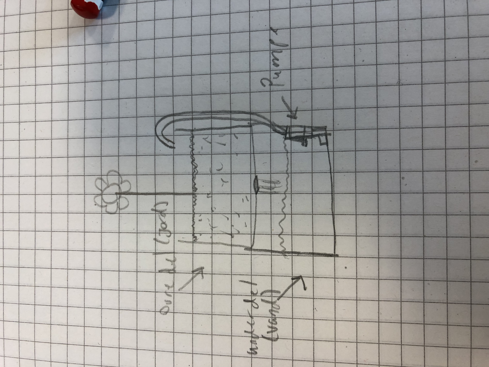

Links:

Moisture Sensor datasheet:
https://it-teknolog.dk/download/Soil%20Moisture%20Sensor%20Module/Soil%20Moisture%20Sensor%20Module.pdf

Code example:
See "Soil_Moisture_Sensor_Module"

Pump:
Possible pipe:
https://www.biltema.dk/fritid/campingvogn-og-autocamper/vand-og-aflob/vandslange-10-m-2000017745?utm_source=google&utm_medium=surfaces&utm_campaign=shopping%20feed&utm_content=free%20google%20shopping%20clicks&gclid=Cj0KCQjwmICoBhDxARIsABXkXlKF4_c78evzeSnHjk-IhEqYnckwjEd4gh7cLrHYCBKMSVijOSng0TIaApvKEALw_wcB&gclsrc=aw.ds

Thoughts:

- Pumpen synes at køre på mellem 5.5-12v nodeNCU chippen giver umiddelbart kun 5v max, undersøg mulighederne.
  Muligvis et 9v batteri som tilføjelse specifikt til pumpen via:
  https://arduinotech.dk/shop/batteri-holder-9v/

printkort:
https://elektronik-lavpris.dk/p87427/h25pr100-board-with-dots-100x100mm/
https://arduinotech.dk/shop/prototype-pcb-print/?attribute_type=Type+4

Ledning:
https://elektronik-lavpris.dk/p124132/w55039-47-lednings-sortiment-9-farver-90m-014mm2-bloed/

Pumpe opsætning:
https://arduinogetstarted.com/tutorials/arduino-controls-pump

relay:
https://arduinotech.dk/shop/relae-modul-1-kanal-hl-level-trigger/