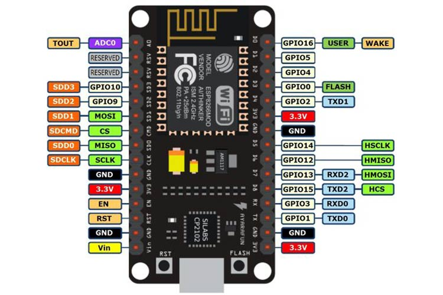
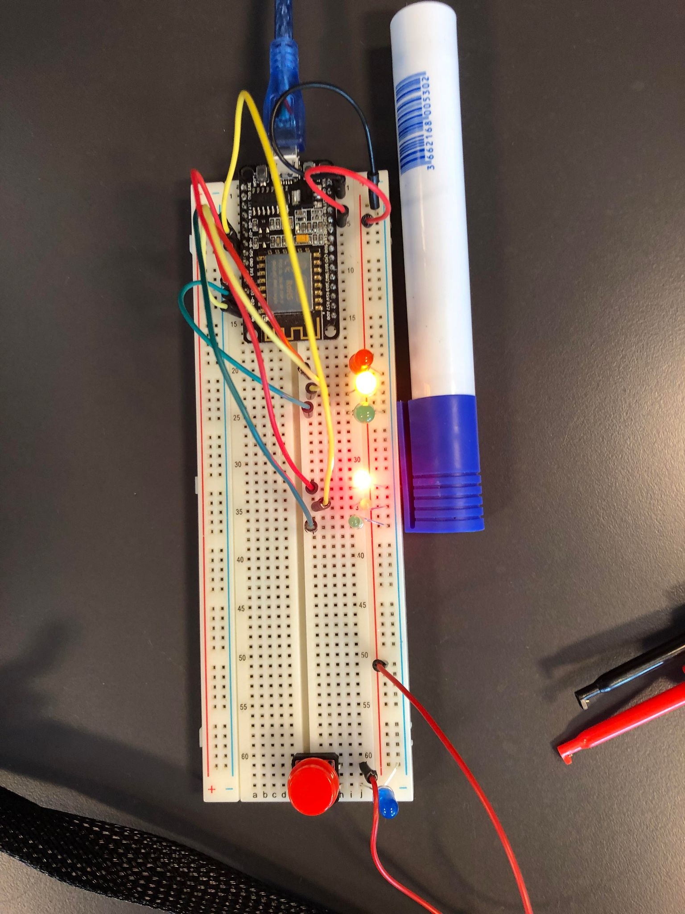
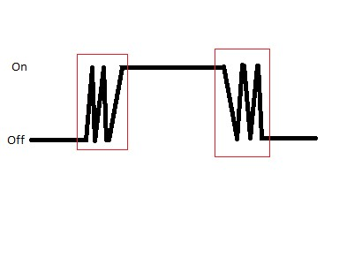

# 22 aug - 2023 - The Board

Fik introduktion til Robotter & automatik som fag samt intro til både C++ og microchippen vi kommer til at benytte. Grundlæggende opsætning af et projekt via PlatformIO (extension i VSCode)
- Chip info samt nyttige links:
NodeMCU 1.0 (ESP-12E Module) (Board) - VSCode setup



I tilfælde af port issues:
https://www.silabs.com/developers/usb-to-uart-bridge-vcp-drivers?tab=downloads

# 25 aug - 2023 - C++ and Programming the board.

Gennemgang af klasser i C++, lært om kredsløb samt intro til første StudyPoint opgave(Trafiklys - se 5 sep - 2023).

Eksempel på udregning af modstand:


For eksempel på klasse se projekt mappe "MyFirstMCU", her er et eksempel fra både d. 22 og 23 hvor vi tester LED både på boarded samt hvordan man sætter porte på chippen til at være indput eller output porte,

```
void setup()
{
  pinMode(redPin, OUTPUT);
  pinMode(yellowPin, OUTPUT);
  pinMode(greenPin, OUTPUT);
}
```

 til eksempelvis at få en LED pære til at lyse, i projektet ses eksempler på hvordan vi fik 3 LED dioder til at blinke.

```
// D3 er porten direkte fra chippen/boarded. //
int redPin = D3; 
int yellowPin = D1;
int greenPin = D2;

void setup()
{
  pinMode(redPin, OUTPUT);
  pinMode(yellowPin, OUTPUT);
  pinMode(greenPin, OUTPUT);
}

void loop()
{
  digitalWrite(redPin, LOW);
  digitalWrite(greenPin, HIGH);
  delay(100);
  digitalWrite(greenPin, LOW);
  digitalWrite(yellowPin, HIGH);
  delay(100);
  digitalWrite(yellowPin, LOW);
  digitalWrite(redPin, HIGH);
  delay(100);
}
```


Vi lærte om brugen af states til at få en serie af handlinger til ske, måden chippen fungere er at der reelt set kun kan ske 1 ting af gangen pr port. Så måden man arbejder med at få flere elementer til at arbejde samtidig er ved at skabe states. Dette fungere på den måde at man i et eksempel med 3 dioder, i state_1 så lyser den første led og de 2 andre slukket. I state_2 lyser midterste dioder og de 2 andre slukket og i state_3 lyser den sidste og de 2 andre slukket. På den måde kan man arbejde via loop funktionen, så de lyser på skift. Med denne måde at tænke på kræver det at hver komponent tænkes ind i hvert stadie. 

Principperne fra undersvisningen skal benyttes i en opgave hvor der skal code 1½ trafiklys, så de skifter som et trafiklys gør i "virkeligheden". billedeksempel på sates og hvornår 1 trafiklys lyser (da der er 2 retninger vises 2x3 pære):


# 26 aug - 2023 - Button / Sensors

Dagen i dag gik mest på at indrage en sensor i et kredsløb plus kode, sensoren vi benyttede var en knap som skulle kunne slukke og tænde en LED diode(Blå LED på billede).



Dagens undervisning gik på både pratisk arbejde samt tavle undervisning i forhold til at kode op imod kredsløbet, en vigtig pointe vi blev præssenteret for i forhold til knappen er den støj der opstår når der klikkes på knappen og lige efter der gives slip på knappen, illustreret herunder(støjen indrammet):



Som det ses i koden her kompensere der med 10 millisekunder før og efter klik:

```
void loop() {
if(digitalRead(buttonPin) == LOW) {
Serial.println(count);
count++;
delay(10); // Compensate for noise when clicking the physical button. 
while (digitalRead(buttonPin) == LOW) 
{
}
delay(10); // Compensate for noise when releasing the physical button. 
{
```
(Se koden i sensor/button for eksempel på knap klasse og uden brug af delay i koden)

En mere kode baseret viden der blev tilegnet var den generelle brug af ENUM i kode. Som er en data type som kan bruges til at sætte en liste af konstanter(eksempel fra sensor/button):

```
class Button
{
public:
    Button(int pin, bool buttonDown);
    void setup(long startTime);
    void update(long now);
    bool GetButtonState();

private:
    enum ButtonState
    {
        Off,
        Push,
        On,
        Release
    };
    const static long _noiseCancelTimer = 10;
    int _pin;
    bool _buttonDown;
    ButtonState _buttonState;
    long _nextChangeTime;
};
```

Senere kan kan en switch case benyttes på følgende måde: 

```
void Button::update(long now)
{
    switch (_buttonState)
    {
    case Off:
        if (digitalRead(_pin) != _buttonDown)
            return;
        {
            _buttonState = Push;
            _nextChangeTime = now + _noiseCancelTimer;
            break;
        }
    case Push:
        if (now < _nextChangeTime)
            return;
        _buttonState = On;
        break;
    case On:
        if (digitalRead(_pin) == _buttonDown)
            return;
        _buttonState = Release;
        _nextChangeTime = now + _noiseCancelTimer;
        break;
    case Release:
        if (now < _nextChangeTime)
            return;
        _buttonState = Off;
        break;
    }
}
```
-------------------

-------------------


# 31 aug - 2023 - WIFI


Til dagen i dag havde hver gruppe fået forskellige sensorer og opgaven at få dem til at virke, min gruppe fik en sonar, vi havde dog lidt udforringer med at få denne til at aflæse afstand, hvor vi testede 3 forskellige kode eksempler som burde virke, men stadig uden held. Eksemplerne ses i sensor mappen og button mappen deri. Selv om der ikke kom et resultat ud af det, var der stadig god læring i at undersøge komponenten i form af datasheets samt læne sig op af artikler og blog posts omkring denne fra andre der har arbejdet med samme komponent. Derudover som det ses i projektet "sonar - third" så har vi forsøgt os med et framework "NewPing" som er specielt lavet til netop den komponent vi arbejdede med. Læringen her lå i at dependencies i nodeMCU ligger i platformio.ini, så skal der tilføjes noget gøres der heri. 

Viden fra undervisningen denne dag gik på hvordan man i platforIO kan finde libraries at benytte, så dette er en viderebygning på det føromtalte, da disse installeres via ini filen. Libraries findes i PIO Home og Libraries fanen herinde. 

Vi opsatt et projekt til at bygge en webserver på MCU'en, projektet ses i Wifi mappen og "Wifi test" projektet heri. 

I forbindelsen med arbejdet med sonar fandt vi flere eksempler af kode hvor 
```
Serial.begin(115200);
```
Var sat som det ses her til 115200. Benyttede vi dette, fik vi en masse ulæselige tegn some kun blev fixet ved at ændre 115200 til 9600. Det viser sig at denne værdi definere skrivehastigheden igennem usb kablet MCU'en er forbundet med. Som det ses i ini filen i wifi projektet kan værdien for projektet definere her.
```
monitor_speed = 115200
```

Hvilket ville have gjort det muligt for os at få læsbare værdier ud i vores sonar test.

Bilioteket vi benyttede til wifi var ESP8266WiFi, ESP8266 er chippen på det MCU board vi benytter, dependency ses også i ini filen.

Koden til webserveren ses samme sted hvor dependency informationen findes PIO home -> libraries og det er denne kode vi også benyttede i vores kode eksempel. Særligt vil jeg sætte focus på koden her i loopet:

```
  if (req.indexOf(F("/gpio/0")) != -1)
  {
    val = 0;
  }
  else if (req.indexOf(F("/gpio/1")) != -1)
  {
    val = 1;
  }
  ```
Når koden uploades og der forbindes med de wifi info der også står i koden, så gives der i terminalen en ip som sammen med hhv. /gpio/0 og /gpio/1 kan få val 0 og val 1 til at "ske":
eks. 127.0.0.1/gpio/0

Dette er humlen i hvordan funktioner kan køres over wifi. 


## Trafiklys projekt - Aflevering d. 5 sep - 2023


Dette er vores første studypoint opgaven og opgaven er baseret på at få 1½ lyskryds til at køre (ikke porte nok på boarded til at kunne køre 2). Men pointen er at få 2 lyskryds til at køre ud fra samme mønster bare asynkront. Mønsteret det skal følge ses på billedet herunder og beskriver de 7 states der skal følges:


Vores trafik lys klasse ser ud på følgende måde:

```
TraficLight(int greenPin, int yellowPin, int redPin, int greenPin1, int yellowPin1, int redPin1,long stateTime []);

instance:
TraficLight traficLight(D2, D1, D0, D5, D4, D3, (long[]){1000, 1000, 1000, 1000, 1000, 1000, 1000, 1000});
```

Gennem dette projekt har vi tilegnet os en indledende forståelse for opbygningen af klasser i C++, en udfordring vi havde i forbindelsen opbygningen af det det halve trafiklys var at måden klassen var opbyggede krævede at vi oplyste 6 PINs men da vi i dette eksempel kun havde 3 forsøgte vi os med NULL. Ud fra vores viden fra java gav dette mening da NULL her er "intet", men det viser sig at i C++ er dette 0, og 0 er en PIN på boarded, hvilket gav fejl i mønsteret vi havde opsat. Da vi fik rettet dette til -1 i stedet virkede vores 1½ kryds. Se video herunder:

https://github.com/Marpeddata/robolog/assets/99390764/d2901565-5902-4440-9c69-0eddae9a66d6


