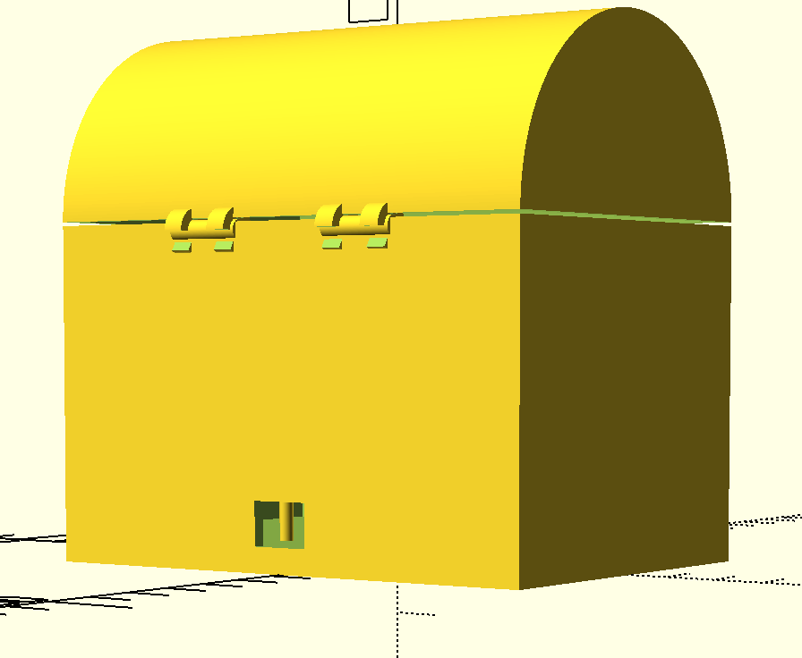

# 22 aug - 2023 - The Board

Fik introduktion til Robotter & automatik som fag samt intro til både C++ og microchippen vi kommer til at benytte. Grundlæggende opsætning af et projekt via PlatformIO (extension i VSCode)

- Chip info samt nyttige links:
  NodeMCU 1.0 (ESP-12E Module) (Board) - VSCode setup


I tilfælde af port issues:
https://www.silabs.com/developers/usb-to-uart-bridge-vcp-drivers?tab=downloads

# 25 aug - 2023 - C++ and Programming the board.

Gennemgang af klasser i C++, lært om kredsløb samt intro til første StudyPoint opgave(Trafiklys - se 5 sep - 2023).

Eksempel på udregning af modstand:


For eksempel på klasse se projekt mappe "MyFirstMCU", her er et eksempel fra både d. 22 og 23 hvor vi tester LED både på boarded samt hvordan man sætter porte på chippen til at være indput eller output porte,

```
void setup()
{
  pinMode(redPin, OUTPUT);
  pinMode(yellowPin, OUTPUT);
  pinMode(greenPin, OUTPUT);
}
```

til eksempelvis at få en LED pære til at lyse, i projektet ses eksempler på hvordan vi fik 3 LED dioder til at blinke.

```
// D3 er porten direkte fra chippen/boarded. //
int redPin = D3;
int yellowPin = D1;
int greenPin = D2;

void setup()
{
  pinMode(redPin, OUTPUT);
  pinMode(yellowPin, OUTPUT);
  pinMode(greenPin, OUTPUT);
}

void loop()
{
  digitalWrite(redPin, LOW);
  digitalWrite(greenPin, HIGH);
  delay(100);
  digitalWrite(greenPin, LOW);
  digitalWrite(yellowPin, HIGH);
  delay(100);
  digitalWrite(yellowPin, LOW);
  digitalWrite(redPin, HIGH);
  delay(100);
}
```


Vi lærte om brugen af states til at få en serie af handlinger til ske, måden chippen fungere er at der reelt set kun kan ske 1 ting af gangen pr port. Så måden man arbejder med at få flere elementer til at arbejde samtidig er ved at skabe states. Dette fungere på den måde at man i et eksempel med 3 dioder, i state_1 så lyser den første led og de 2 andre slukket. I state_2 lyser midterste dioder og de 2 andre slukket og i state_3 lyser den sidste og de 2 andre slukket. På den måde kan man arbejde via loop funktionen, så de lyser på skift. Med denne måde at tænke på kræver det at hver komponent tænkes ind i hvert stadie.

Principperne fra undersvisningen skal benyttes i en opgave hvor der skal code 1½ trafiklys, så de skifter som et trafiklys gør i "virkeligheden". billedeksempel på sates og hvornår 1 trafiklys lyser (da der er 2 retninger vises 2x3 pære):


# 26 aug - 2023 - Button / Sensors

Dagen i dag gik mest på at indrage en sensor i et kredsløb plus kode, sensoren vi benyttede var en knap som skulle kunne slukke og tænde en LED diode(Blå LED på billede).


Dagens undervisning gik på både pratisk arbejde samt tavle undervisning i forhold til at kode op imod kredsløbet, en vigtig pointe vi blev præssenteret for i forhold til knappen er den støj der opstår når der klikkes på knappen og lige efter der gives slip på knappen, illustreret herunder(støjen indrammet):


Som det ses i koden her kompensere der med 10 millisekunder før og efter klik:

```
void loop() {
if(digitalRead(buttonPin) == LOW) {
Serial.println(count);
count++;
delay(10); // Compensate for noise when clicking the physical button.
while (digitalRead(buttonPin) == LOW)
{
}
delay(10); // Compensate for noise when releasing the physical button.
{
```

(Se koden i sensor/button for eksempel på knap klasse og uden brug af delay i koden)

En mere kode baseret viden der blev tilegnet var den generelle brug af ENUM i kode. Som er en data type som kan bruges til at sætte en liste af konstanter(eksempel fra sensor/button):

```
class Button
{
public:
    Button(int pin, bool buttonDown);
    void setup(long startTime);
    void update(long now);
    bool GetButtonState();

private:
    enum ButtonState
    {
        Off,
        Push,
        On,
        Release
    };
    const static long _noiseCancelTimer = 10;
    int _pin;
    bool _buttonDown;
    ButtonState _buttonState;
    long _nextChangeTime;
};
```

Senere kan kan en switch case benyttes på følgende måde:

```
void Button::update(long now)
{
    switch (_buttonState)
    {
    case Off:
        if (digitalRead(_pin) != _buttonDown)
            return;
        {
            _buttonState = Push;
            _nextChangeTime = now + _noiseCancelTimer;
            break;
        }
    case Push:
        if (now < _nextChangeTime)
            return;
        _buttonState = On;
        break;
    case On:
        if (digitalRead(_pin) == _buttonDown)
            return;
        _buttonState = Release;
        _nextChangeTime = now + _noiseCancelTimer;
        break;
    case Release:
        if (now < _nextChangeTime)
            return;
        _buttonState = Off;
        break;
    }
}
```

---

## 

# 31 aug - 2023 - WIFI

Til dagen i dag havde hver gruppe fået forskellige sensorer og opgaven at få dem til at virke, min gruppe fik en sonar, vi havde dog lidt udforringer med at få denne til at aflæse afstand, hvor vi testede 3 forskellige kode eksempler som burde virke, men stadig uden held. Eksemplerne ses i sensor mappen og button mappen deri. Selv om der ikke kom et resultat ud af det, var der stadig god læring i at undersøge komponenten i form af datasheets samt læne sig op af artikler og blog posts omkring denne fra andre der har arbejdet med samme komponent. Derudover som det ses i projektet "sonar - third" så har vi forsøgt os med et framework "NewPing" som er specielt lavet til netop den komponent vi arbejdede med. Læringen her lå i at dependencies i nodeMCU ligger i platformio.ini, så skal der tilføjes noget gøres der heri.

Viden fra undervisningen denne dag gik på hvordan man i platforIO kan finde libraries at benytte, så dette er en viderebygning på det føromtalte, da disse installeres via ini filen. Libraries findes i PIO Home og Libraries fanen herinde.

Vi opsatt et projekt til at bygge en webserver på MCU'en, projektet ses i Wifi mappen og "Wifi test" projektet heri.

I forbindelsen med arbejdet med sonar fandt vi flere eksempler af kode hvor

```
Serial.begin(115200);
```

Var sat som det ses her til 115200. Benyttede vi dette, fik vi en masse ulæselige tegn some kun blev fixet ved at ændre 115200 til 9600. Det viser sig at denne værdi definere skrivehastigheden igennem usb kablet MCU'en er forbundet med. Som det ses i ini filen i wifi projektet kan værdien for projektet definere her.

```
monitor_speed = 115200
```

Hvilket ville have gjort det muligt for os at få læsbare værdier ud i vores sonar test.

Bilioteket vi benyttede til wifi var ESP8266WiFi, ESP8266 er chippen på det MCU board vi benytter, dependency ses også i ini filen.

Koden til webserveren ses samme sted hvor dependency informationen findes PIO home -> libraries og det er denne kode vi også benyttede i vores kode eksempel. Særligt vil jeg sætte focus på koden her i loopet:

```
  if (req.indexOf(F("/gpio/0")) != -1)
  {
    val = 0;
  }
  else if (req.indexOf(F("/gpio/1")) != -1)
  {
    val = 1;
  }
```

Når koden uploades og der forbindes med de wifi info der også står i koden, så gives der i terminalen en ip som sammen med hhv. /gpio/0 og /gpio/1 kan få val 0 og val 1 til at "ske":
eks. 127.0.0.1/gpio/0

Dette er humlen i hvordan funktioner kan køres over wifi.

## Trafiklys projekt - Aflevering d. 5 sep - 2023

Dette er vores første studypoint opgaven og opgaven er baseret på at få 1½ lyskryds til at køre (ikke porte nok på boarded til at kunne køre 2). Men pointen er at få 2 lyskryds til at køre ud fra samme mønster bare asynkront. Mønsteret det skal følge ses på billedet herunder og beskriver de 7 states der skal følges:


Vores trafik lys klasse ser ud på følgende måde:

```
TraficLight(int greenPin, int yellowPin, int redPin, int greenPin1, int yellowPin1, int redPin1,long stateTime []);

instance:
TraficLight traficLight(D2, D1, D0, D5, D4, D3, (long[]){1000, 1000, 1000, 1000, 1000, 1000, 1000, 1000});
```

Gennem dette projekt har vi tilegnet os en indledende forståelse for opbygningen af klasser i C++, en udfordring vi havde i forbindelsen opbygningen af det det halve trafiklys var at måden klassen var opbyggede krævede at vi oplyste 6 PINs men da vi i dette eksempel kun havde 3 forsøgte vi os med NULL. Ud fra vores viden fra java gav dette mening da NULL her er "intet", men det viser sig at i C++ er dette 0, og 0 er en PIN på boarded, hvilket gav fejl i mønsteret vi havde opsat. Da vi fik rettet dette til -1 i stedet virkede vores 1½ kryds. Se video herunder:

https://github.com/Marpeddata/robolog/assets/99390764/d2901565-5902-4440-9c69-0eddae9a66d6

# 5. September - 3D modellering OpensCAD + JavaCSG


```
package org.abstractica.javacsg.example;

import org.abstractica.javacsg.Geometry2D;
import org.abstractica.javacsg.Geometry3D;
import org.abstractica.javacsg.JavaCSG;
import org.abstractica.javacsg.JavaCSGFactory;

public class myfirst3dmodel {

    public static void main(String[] args) {
        JavaCSG csg = JavaCSGFactory.createDefault();

        //Bygger første box
        Geometry3D test = csg.box3D(5,5,10,true);
        //Bygger udstikker box
        Geometry3D testExt = csg.box3D(4,4,12,true);

        //Roterer første box på x aksen og laver en ny kopi
        Geometry3D box = csg.rotate3DX(csg.degrees(90)).transform(test);

        //Roterer første box på y aksen og laver en ny kopi
        Geometry3D boxY = csg.rotate3DY(csg.degrees(90)).transform(test);

        //Roterer udstikker box på x aksen og laver en ny kopi
        Geometry3D boxExt = csg.rotate3DX(csg.degrees(90)).transform(testExt);

        //Roterer udstikker box på y aksen og laver en ny kopi
        Geometry3D boxExty = csg.rotate3DY(csg.degrees(90)).transform(testExt);

        //tegner en 2d cirkel 5 i diameter opløsning 64 bit
        Geometry2D circle = csg.circle2D(5,64);

        //Extruder cirklen 5 - False får objektet til at stå på z aksen.
        Geometry3D circlebox = csg.linearExtrude(5,false, circle);

        //Samler alle 3 versioner af "første boks"
        Geometry3D union = csg.union3D(box,test,boxY);

        //Samler alle 3 versioner af udstikker boks
        Geometry3D unionExt = csg.union3D(boxExt,testExt, boxExty);

        //Fratrækker udstikker boks fra første boks modellen.
        Geometry3D boxer = csg.difference3D(union, unionExt);


            //Viser boxer se vedhæftede billede.
            csg.view(boxer);
//        csg.view(circlebox);
    }


}
```

# 7 September 2023 - 3D print

Formålet med i dag var at modellere en kasse til vores MCU chip, her benyttede vi JavaCSG. Efter at have leget med dette framework til i dag var det rart at kunne se Tobias' tilgang til kodning af 3D modeller i JavaCSG. Selv om egen kode primært blev lavet med henblik på lære funktionerne at kende, er det <u>afskyelig</u> i forhold til struktur, tag et kig på eget ansvar i mappen "playingaround" i 3D folderen.


### Jitpack

Et interassant værktøj/dependency vi blev introduceret til også i undervisningen var https://jitpack.io
Med denne er det muligt at tage et repository fra github og skabe en dependency i vores eget java projekt så man eksempelvis kan bruge classer fra dette repo. Vi brugte det i projektet under 3D folder "MCUbox" til at kunne importere hele biblioteket fra JavaCSG så ikke man er nød til at modellere via en klon af dette repo.

---

Ligeledes i MCUboxen kan koden til vores kasse til MCU'en findes:


Målene blev taget i undervisning og senere brugt som referancer til modelleringen i JavaCSG/OpenSCAD:

<table>
  <tr>
    <td></td>
    <td></td>
  </tr>
</table>


# 12 September 2023 - Oplæg

Dagen i dag gik mest af alt på et oplæg af et fælles projekt med henblik på eksamen, Tobias fremlagde ideen om at lave en togbane som kunne styres via nodemcu, her var planen at lave alt fra spor og sporskifte til togets konstruktion og div vogne. Havde selv min egen ide så selv om dette var et udemærket forslag gik jeg med at lave et automatisk vande system til en potteplante.

Ideen som udgangspunk:

- Sensor til at måle fugtighed i jorden.
- Kode til nodeMCU der kontrollerede i intervaller ex. hvert 5min.
- Vandpumpe der kunne aktiveres via samme kode/funktion på mcu'en, ved en given fugtighed.
- Hvis tiden er til det ville jeg også gerne få logget aflæsningerne af fugtigheden til at indsamle data.

Ideen blev som udgangspunkt godkendt af Tobias men der blev lagt vægt på at foruden kontruktionen til at huse alle komponenterne så skulle der også designes vandbeholder og urtepotte med henblik på 3d print.

# 15 + 19 September 2023 - Down with the sickness


# 22 September 2023 - Modellering

I dag fik jeg lavet en 3D model af fugtighedsmåleren til mit system, formålet med denne er at kunne bruge den som cutout til holderen denne skal sidde i og derfor er begge ben ikke modelleret til fulde da det er meningen de skal stikke ud for at sidde i jorden.


#### Model:
------------------------


#### Sensor:
------------------------


Foruden dette arbejde fik jeg også lavet research på opsætningen og kredsløb, samt fundet kode eksempel på sensores, dette kan ses i "plantesystem" mappen.

# 26 September 2023 - Skift af retning

Grundet en hvis form for stress over tiden der er tilbage før eksamen og nå at blive færdig, valgte jeg at sadle om og fik lov at joine en gruppe for at kunne være flere om samme projekt. Derfor er målsætningen nu at lave et spilledåse der kan spille musik. Planen er at modellere en spilledåse hvori nodeMCU'en skal være, sammen med 2 komponenter, en lille højtaler samt en knap. Højtaleren skal spille temaet fra Pirates of the Caribbean og knappen skal bruges til at sikre at spille dåsen kun spiller når kassen er åben.

Dagen blev brugt på at modellere og lave prøveprint af hængslerne der skal holde låg og kasse sammen. Først blev der brainstormet på ideer og vi endte med formen herunder:


#### Model
----------------------------------------------------------------
<table>
  <tr>
    <td></td>
    <td></td>
  </tr>
</table>

#### Printet:
----------------------------------------------------------------
<table>
  <tr>
    <td></td>
    <td></td>
  </tr>
</table>


# 29 September 2023 - Polyhedron + Nyt prøveprint af hængsel


Da vi i gruppen talte om at nogle afbilleder af skatteskister ikke alle havde rette linjer, besluttede jeg mig for at bruge tiden idag på at arbejde med værktøjet i JavaCSG kaldet Polyhedron.


Med billedet herover for øje kom arbejded jeg mig hen imod formen som ses indledningsvis. Koden herunder et et eksempel på opbygningen af en polyhedron:

```
Geometry3D chest = csg.polyhedron3D(vertices, all);
```

Først samles en liste over alle punkterne i den form der ønskes tegnet, kaldet vertices:

```
List<Vector3D> vertices = new ArrayList<>();
		vertices.add(csg.vector3D(1.5, 1.5, 1));
		vertices.add(csg.vector3D(-1.5, 1.5, 1));
		vertices.add(csg.vector3D(-1.5, -1.5, 1));
		vertices.add(csg.vector3D(1.5, -1.5, 1));
		vertices.add(csg.vector3D(1, 1, -1));
		vertices.add(csg.vector3D(-1, 1, -1));
		vertices.add(csg.vector3D(-1, -1, -1));
		vertices.add(csg.vector3D(1, -1, -1));
```

Derefter samles en ny liste med lister som definere hver side i formen. Her tages der udgangspunkt listen af vertices og hver side defineres ud fra indexet i vertices listen:

```
List<Integer> side1 = new ArrayList<>();
side1.add(6);
side1.add(7);
side1.add(3);
side1.add(2);
```

Her er det vigtigt at rækkefølgen går imod uret, illutreret på billedet her:


I tilfældet her samles der 6 sider af kassen til sidste i listen "all" som bruges i polyhedron værktøjet(se længere oppe):

```
List all = new ArrayList<>();
		all.add(side1);
		all.add(side2);
		all.add(side3);
		all.add(side4);
		all.add(side5);
		all.add(side6);
```

Vi fik lavet endnu et prøveprint med småjusteringer til hængslet, som ses på billedet her:


--------


----------------------------------------------------------------

# 3 Oktober 2023 - Prøveprint af Kasse design + låg

Dagen blev brugt på at sammensætte hængsler med kasse konstruktionen, derudover tog vi pindende fra nodeMCU kassen der blev modelleret og printet demonstreret tilbage d. 7 september, til at fiksere boarded i bunden af kassen, der blev også tilføjet et hul til USB-kablet så strøm kan gives til boarded når kassen er lukket.


Grundet huller til gribere samt USB var vi nød til at tilføje support til printet som krævede rens af printet.


Udfordringer ved først print:
- Ikke plads til at få låget påsat uden at mase elementerne sammen.
- Masen resulterede i at et af griberne knækkede.
- For lidt plads til at kunne have alle komponenterne vi ønsker nede i kassen.
- Ikke taget højde for kassens tykkelse da hullet til USB kablet blev placeret, som resulterede i at det ikke kunne komme igennem.

#### Tester nodeMCU med buzzer og knap.


#### Testprint af låg og kasse sat sammen.


----------------------------------------------------------------

# 6 Oktober 2023 - Litophane 

Da vi arbejder med en skattekiste kræver det også at indholdet af kassen er derefter, vores indledende ide var at printe gulmønter, men da dette ville kræve print af en større mængde mønter til at putte i kassen, søgte vi andre muligheder og faldt over Litophane printing som er en metode hvor du nytter print tykkelse og lysets gennemtrængning i materialet til at skabe motiver der kommer til sin ret med lys bag ved printet.


Fordelen med at benytte var at vi kunne skabe en rum under laget med billedet i kassen hvor der var plads til vores komponenter, vi øjnede også at vi skulle tilføje LED pære til vores kredsløb under printet. Billedet herunder blev benyttet til litophane:


Litophane blev genereret uden om JavaCSG og OpensCAD via hjemmesiden her:

https://itslitho.com/


----------------------------------------------------------------

# 10 Oktober 2023 - Fokus på knap og lukkemekanismen

Formålet med kassen er som tidligere beskrevet at når denne åbnes skal der spilles pirates of the caribbean og nu med den tilføjelse at der også skal være lys i kassen, alt dette skal styres via en knap som låget trykker ned for at slukke hele systemet. Vi skal derfor fiksere knappen i toppen af kassen og have låget til at lukke ned over knappen. 

Der blev her modelleret følgende design til at holde knappen:


På trods af mål på knappen lavede vi et prøve print til at teste størrelsen mod knap komponeneten.


Selv om billedet ikke afspejler dette helt, passede knappen perfekt ned i. Lidt for perfekt hvilket gjorde det svært at få knappen ud. Så vi justerede en smule på designet før tilføjelsen til selve kasse designet. 

Knappen er den eneste komponent i nuværende design som ikke sidder på et fumplebrændt og krævede derfor lodning:


Desginet med rillen i midten er så knappen kan monteres fra siden med plads til ledningerne fastlodet på knappen.

Vi kom her tættere og tættere på næste iteration af kasse designet, og der blev opdateret rettelserne fra d. 3, samt tilføjet en rille til litophane laget, samt en kant i kassens låg til at lukke ned over knappen for at sikre en lukket kasse også (de)aktiverede knappen. Som tidligere beskrevet ville vi gerne forsøge at få formen på kassen til at ligne en skattekiste, men afviger fra formen fra d. 29 september. Derimod har vi ændret låget så dette er rundt. For at gøre plads til LED'er samt 2 små fumplebræder, har vi også gjort størrelsen på kasse en smule større.

<table>
  <tr>
    <td></td>
    <td></td>
  </tr>
</table>
<table>
  <tr>
    <td></td>
    <td></td>
  </tr>
</table>

